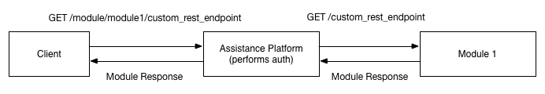

This document will provide you with information about extending the platforms REST API by providing module specific REST endpoints.

# Purpose of REST API Extensions
In some cases there can be a need for clients that are specialized for a specific module. In order to be special these special clients need to access some REST API which offers more (specialized) endpoints than the generalized Platform API. For example the "Drive Calm" example module could offer a special endpoint where it provides a list of all speed exceedings of the last month. Or a "action" endpoint to clear the data, set specific setting, etc..

# How does this extension from a communication perspective work?
The client knows the IDs of modules. He then can make a normal HTTP request to `/assistance/:module/custom/*path`. The platform then will lookup the IP of the modules REST server and forward the request to `*path` on the modules REST server. 



# How can I implement a REST extension for my module?
In order to build a REST extension you just need to implement the `generateCustomServlets()` in your `AssistanceModule` sub-class.

You can use normal servlets and wrap them with the `MappedServlet` class to map the paths. The constructor `MappedServlet` used in the following example maps a basic Jersey service class - this is the recommended way. But however you can also pass your custom `ServletHolder`, if required. **Note:** When using the Jersey way, then you need to make sure, that all your servlets live in their own packages, otherwise the path mapping will be confused!

```java
	@Override
	protected Collection<MappedServlet> generateCustomServelets() {
		MappedServlet example = new MappedServlet("/example", ExampleService.class);
		
		return Arrays.asList(example);
	}
```

A example Jersey service could look like:
```java
package de.tudarmstadt.informatik.tk.assistanceplatform.modules.example.assistance.examplews;

import javax.ws.rs.Consumes;
import javax.ws.rs.GET;
import javax.ws.rs.POST;
import javax.ws.rs.Path;
import javax.ws.rs.Produces;
import javax.ws.rs.core.MediaType;

@Path("/")
public class ExampleService {
	@Path("/test")
	@GET
	@Produces(MediaType.APPLICATION_JSON)
	public String test() {
		return "{'test' : 'yes'}";
	}
	
	@POST
	@Path("/posttest")
	@Produces(MediaType.APPLICATION_JSON)
	@Consumes(MediaType.APPLICATION_JSON)
	public String posttest(String postData) {
		return postData;
	}
}
```

# How to know which user started the request?
Just read the `ASSISTANCE-USER-ID` HTTP-Header-Field.

# How to access Cassandra inside the custom endpoint?
`ServiceResourcesFactory.getInstance().getAssistanceModule().getCassandraSession()`

# How to excactly reach these endpoints?
## From client perspective via platform
The client should always go over the platform and can reach the custom endpoint (for the example above) on the following URLs: `http://platform/assistance/{idOfExampleModule}/custom/example/test`and `http://platform/assistance/{idOfExampleModule}/custom/example/posttest`

## For testing purposes
For testing just your module REST service you can use:
`http://localhost:21314/rest/custom/example/test`and `http://localhost:21314/rest/custom/example/posttest`.

So like you can see `http://localhost:21314/rest/custom/` is the API fixed part of the URL, everything afterwards is specified by your servlet implementation.